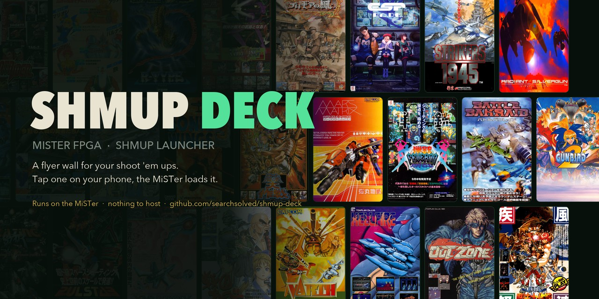
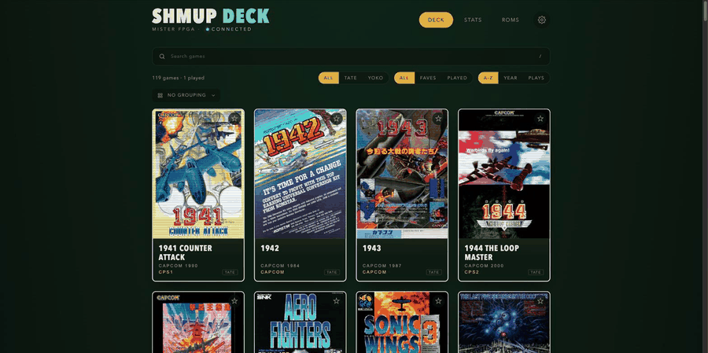

# Shmup Deck



A flyer-wall launcher for shoot 'em ups on the MiSTer FPGA. Open it on your
phone, tap a flyer, and the MiSTer loads the game. It runs on the MiSTer
itself: nothing to host, no PC, no other service to install.



- 205 shooters on 64 arcade boards: Toaplan, Cave, CV1000, CPS1/CPS2, PGM,
  Psikyo, Raizing, Konami, Irem, NMK, Taito, Seta, Sega ST-V, Neo Geo and more
- Only games installed on your SD card show, unless you ask to see the rest
- Filter by screen (tate or yoko) and region; sort by name, year or plays;
  group by developer, board or deck; search by title, developer or board
- Decks: your own lists of games, shareable by link, plus a community set
- Launch counts and time played for every game, however it was started
- A ROM checklist of what each game still needs: the MRA, the core or the zips
- Kiosk mode for a tablet by the cab

Release notes are in [CHANGELOG.md](CHANGELOG.md).

## Install

1. Download [`shmup_deck.sh`](https://github.com/searchsolved/shmup-deck/releases/latest/download/shmup_deck.sh)
   to the `Scripts` folder on your SD card.
2. On the MiSTer, run `shmup_deck` from the Scripts menu.
3. On your phone, open **http://shmupdeck.local** and add it to your home screen.

If `shmupdeck.local` doesn't resolve on your network, use the numbered address
the script shows, such as `http://192.168.1.50:8190`.

The first start scans your arcade folders and downloads the flyer art, which
takes a few minutes. Games appear when the scan finishes; flyers fill in as
they arrive.

**Updating:** when a new release is out, a dot appears on the settings cog.
Tap **Update** in Settings, or run `shmup_deck` from the Scripts menu again.
Flyers, play history, decks and settings are kept.

**Removing:** run `shmup_deck.sh uninstall` over SSH. Files live in
`/media/fat/Scripts/.config/shmup_deck/`.

## Using it

- **Settings are kept on the MiSTer**, so every phone sees the same decks,
  region and play counts. Screen orientation is asked on the first visit and
  kept per device.
- **Region** is the cab's choice: with Japan picked, games with a Japanese set
  show and launch that set.
- **Several versions:** a card marked "4 sets" has several MRAs of that game.
  Tap the mark, or hold the card, to choose which one launches. Versions that
  play differently, such as Dai-Ou-Jou Black Label or Progear Red Label, have
  their own cards.
- **Now playing** shows on the wall, and the flyer fills the screen until you
  tap it. An optional **Back to menu** button (off by default, in Settings)
  returns the MiSTer to its own menu, like the User button.

### Decks

A deck is a list of games in the order you choose. Create one on the Decks
page, then tap games on the wall to add them; Edit reorders it, sets a cover
flyer and a description. **Share** makes a link that carries the whole deck,
and anyone opening it on their own MiSTer can save it. The Decks page also has
automatic decks (most played, not played yet, tonight's ten) and community
decks; to add yours, open a pull request to [`decks/`](decks/).

### Kiosk mode

For a tablet by the cab: only the wall, full screen, kept awake, with flyers
drifting by when idle. Turn it on in Settings or open
`http://shmupdeck.local/?kiosk`; limit it to one deck with
`?kiosk=<deck id>`. Hold the top left corner for two seconds to leave.

## Requirements

- A MiSTer with network access
- MRAs and ROMs for the games you want. MRAs can be anywhere under `_Arcade`
  or any other top-level `_` folder, on the SD card or a USB drive, in any
  folder layout
- The cores for those games
- For Neo Geo: the Neo Geo core and games in `games/NeoGeo`

[ROMS.md](ROMS.md) lists every game with its core, where to get it and the ROM
zips it needs. **http://shmupdeck.local/check.html** checks all of this against
your SD card. Games on cores that Update All doesn't distribute never show as
missing; they appear once you install the core.

Shmup Deck contains no ROMs, MRAs or cores.

### Neo Geo formats

| Format | Status |
| --- | --- |
| `.neo` files, e.g. `blazstar.neo` or `Blazing Star (blazstar).neo` | Tested |
| Darksoft sets as a folder or zip named by setname | Detected, untested; reports welcome |
| MAME zips with your own `romsets.xml` | Detected, untested; reports welcome |

Neo Geo games launch through a generated MGL file. The MiSTer only reports
"NEOGEO" while one runs, so Now playing shows the last Neo Geo game launched
from the deck.

## How it works

`shmup_deck.py` is a small Python service using only the standard library that
ships with the MiSTer. It:

- reads the MAME setname inside every `.mra` in the top-level `_` folders, so
  games match exactly (Gunbird is never mistaken for Gunbird 2) whatever your
  folders are called
- prefers the plain release over alternatives, bootlegs, free play edits and
  duplicates
- launches by writing `load_core <path>` to `/dev/MiSTer_cmd`
- serves the app on port 80 (if free) and 8190
- answers mDNS for `shmupdeck.local` itself, since the MiSTer image has no
  Avahi (`--name` sets a different name)

### Resource usage

Baseline measured on 1.4.3 on a DE10-Nano (492 MB RAM on the ARM side), with
30,681 MRAs on the card.

| | Idle (menu) | During rescan | After rescan | Game running |
|---|---|---|---|---|
| Memory | 14 MB | 25 MB peak | 18 MB | 18 MB |
| CPU (one core) | 0.1% | about 90%, at low priority | 0.1% | 0.08% |

A full rescan takes 45 to 90 seconds at nice 10, so the MiSTer's own work comes
first. It runs on first start, when a drive or folder is added, or on request.
Otherwise the service polls a file every few seconds. Every release is
benchmarked against this baseline (see Development).

### Flyer art

Flyers are not in this repository. Each is downloaded once on first start,
about 20 MB in total, and stored on your SD card. They come from
[shmup-deck-art](https://github.com/searchsolved/shmup-deck-art), a mirror of
the original scans cut to size, pinned in `art.json`. If the mirror is down,
the original is fetched from its source: the
[libretro thumbnails](https://github.com/libretro-thumbnails/MAME), LaunchBox,
The Arcade Flyer Archive, arcadeartwork.org, Wikipedia or archive.org. All
flyer artwork belongs to its copyright holders.

A card with no flyer shows the game title. A few games have no portrait flyer
anywhere I could find; [FLYERS_WANTED.md](FLYERS_WANTED.md) lists them, and
links to better scans are welcome.

## Adding games

Games are listed in `shmup_deck/app/games.json`:

```json
{
 "id": "gunbird",
 "title": "Gunbird",
 "dev": "Psikyo",
 "year": 1994,
 "core": "Psikyo",
 "system": "Psikyo 68EC020",
 "orientation": "tate",
 "setnames": ["gunbird"],
 "rbf": "Arcade-Psikyo",
 "roms": {"zip": "gunbird", "merged": "gunbird", "shared": []}
}
```

- `setnames`: the MAME sets that count as this game, preferred first
- `orientation`: which way the monitor is fitted for it
- `system`: the arcade board, used for grouping
- `rbf`: the core the MRA names; `cores.json` says where it comes from
- `roms`: the non-merged zip, the merged zip that holds it, and any shared
  BIOS or chip zips

Then run `python3 tools/build_rom_list.py` to rebuild ROMS.md. Flyer sources go
in `shmup_deck/app/art.json`; `tools/build_art_manifest.py` works out each
crop and `tools/build_art_mirror.py` rebuilds the mirror.

## API

| Method | Path | |
| --- | --- | --- |
| GET | `/api/status` | version, scan and art progress, now playing, update state |
| GET | `/api/available` | game id to installed MRA path (null if missing) |
| GET | `/api/checklist` | per game: ready, or the missing MRA, core or ROM zips |
| GET | `/api/stats` | launches, seconds played and last played per game |
| GET | `/api/decks` | all decks |
| GET | `/api/settings` | region |
| GET | `/api/versions?id=<id>` | installed versions of a game and the chosen one |
| POST | `/api/launch` | `{"id": "gunbird"}`, optionally `"set"` |
| POST | `/api/decks` | `{"deck": {...}}` saves, `{"delete": id}` removes, `{"member": {"deck", "id", "on"}}` adds or removes a game |
| POST | `/api/settings` | `{"region": "japan"}`; `"any"` or null clears it |
| POST | `/api/version` | `{"id", "set"}` remembers a version; a null set forgets it |
| POST | `/api/rescan` | rescan MRAs; only changed files unless `{"full": true}` |
| POST | `/api/update/check` | check GitHub for a newer release |
| POST | `/api/update` | install the newer release and restart |
| POST | `/api/menu` | load the MiSTer menu |

## Development

`tools/release.sh <version>` is the release checklist. It checks the version, a
clean tree and a [CHANGELOG.md](CHANGELOG.md) entry (write that first, or it
refuses to run), rebuilds ROMS.md, benchmarks the build running on your MiSTer,
packages `dist/` and publishes the GitHub release with the changelog entry as
notes.

`tools/bench.py` times a full rescan, then watches the service idle on the menu
and with a game running, 30 minutes each by default. It fails the release if,
against `tools/bench_baseline.json`, memory rises by more than a quarter, CPU
passes 1% of a core, or a rescan is half again as slow. `--save` makes the
current numbers the new baseline.

## License

MIT. See [LICENSE](LICENSE).

The rocket favicon is from [Twemoji](https://github.com/jdecked/twemoji),
licensed under [CC-BY 4.0](https://creativecommons.org/licenses/by/4.0/).

The display font is [Press Start 2P](https://github.com/google/fonts/tree/main/ofl/pressstart2p)
by CodeMan38, licensed under the SIL Open Font License 1.1
(`shmup_deck/app/fonts/OFL.txt`).
