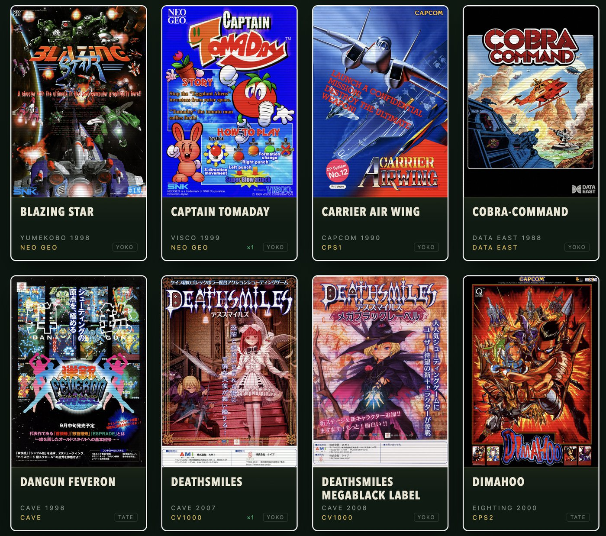

# Shmup Deck

A flyer-wall launcher for shoot 'em ups on the MiSTer FPGA. Open it on your
phone, tap a flyer, and the MiSTer loads the game.

It runs on the MiSTer itself. There is nothing to host, no PC involved and no
other service to install.



- 178 auto-scrolling shooters, mostly from 1985 onwards, across Toaplan, Cave,
  CV1000, Capcom CPS1/CPS2, PGM, Psikyo, Raizing, Konami, Irem, NMK, Taito F3,
  Seta, Sega ST-V, Neo Geo and more
- Only games actually installed on your SD card are shown
- Star games to build your own favourites deck, kept on the MiSTer so every
  phone sees the same one; a Copy link button gives a URL that opens just those
- Show all, favourites or played; sort by name, year or most played; group by
  developer or arcade system; search by title, developer or system
- Settings: which way the monitor is fitted (tate or yoko), whether to show
  games the MiSTer can't run yet, and a compact layout
- Shows what is playing right now
- A ROM checklist page shows what each game still needs on your MiSTer: the
  MRA, the core or the ROM zips
- Time played and launches are counted on the MiSTer for every game, however
  it was started, with a stats page of your most played

## Install

1. Download [`shmup_deck.sh`](https://github.com/searchsolved/shmup-deck/releases/latest/download/shmup_deck.sh)
   and copy it to the `Scripts` folder on your SD card.
2. On the MiSTer, open the Scripts menu and run `shmup_deck`.
3. On your phone, open **http://shmupdeck.local** and add it to your home
   screen if you like.

The address stays the same even when your router gives the MiSTer a new IP.
If `shmupdeck.local` doesn't load on your network, the script also shows the
numbered address, like `http://192.168.1.50:8190`, which always works.

The first start scans your arcade folders and downloads the flyer art, which
takes a few minutes. Games appear as soon as the scan finishes and flyers fill
in as they arrive.

Run `shmup_deck` from the Scripts menu again at any time to update.

To remove it from startup, run `shmup_deck.sh uninstall` over SSH. Files live
in `/media/fat/Scripts/.config/shmup_deck/`.

## Requirements

- A MiSTer with network access
- Arcade MRAs and ROMs for the games you want. MRAs can be anywhere under
  `_Arcade` or another top-level `_` folder, on the SD card or a USB drive, in
  any folder layout including organised sets
- For Neo Geo games: the Neo Geo core and games in `games/NeoGeo` (on the SD
  card or a USB drive, subfolders are fine)
- The cores for those games

[ROMS.md](ROMS.md) lists every supported game with its core, where to get the
core and the ROM zips it needs. Several cores are not in update_all; that page
links to each one. On the MiSTer itself, **http://shmupdeck.local/check.html**
checks all of this against your SD card.

### Neo Geo formats

| Format | Status |
| --- | --- |
| `.neo` files, e.g. `Blazing Star (blazstar).neo` or `blazstar.neo` | Tested |
| Darksoft sets as a folder or zip named by setname, e.g. `blazstar/` | Detected, not yet tested; reports welcome |
| MAME zips with your own `romsets.xml` | Detected, not yet tested; reports welcome |

Neo Geo games are launched through a generated MGL file. The MiSTer reports
only "NEOGEO" while one is running, so "Now playing" shows the last Neo Geo
game launched from the deck.

Shmup Deck contains no ROMs, MRAs or cores.

## How it works

`shmup_deck.py` is a small Python service using only the standard library that
ships with the MiSTer. It:

- reads the MAME setname inside every `.mra` in the top-level `_` folders of
  the SD card and USB drives (`_Arcade`, and any others such as a quick-launch
  `_CAVE CV1000`), so
  games are matched exactly (Gunbird is never confused with Gunbird 2) and
  your folder names don't matter
- prefers the plain release over alternatives, bootlegs, free play edits and
  duplicates in sorting folders
- launches by writing `load_core <path>` to `/dev/MiSTer_cmd`, the MiSTer's own
  command interface
- serves the web app on port 80 (if free) and port 8190
- answers mDNS lookups for `shmupdeck.local` itself, since the MiSTer image
  has no Avahi (start it with `--name` to use a different name)

## Flyer art

Flyer art is not included in this repository. On first start each flyer is
downloaded once, a couple of seconds apart, from a pinned snapshot of the
[libretro thumbnails](https://github.com/libretro-thumbnails/MAME) archive
(plus a few from arcadeartwork.org and Wikipedia), and stored on your SD card.
All flyer artwork belongs to its respective copyright holders.

If a flyer can't be downloaded, its card shows the game title instead.

A few games have no portrait flyer scan anywhere I could find, so their best
available art is shown whole on the card. [FLYERS_WANTED.md](FLYERS_WANTED.md)
lists them; links to better scans are very welcome.

## Adding games

Games are listed in `shmup_deck/app/games.json`:

```json
{
 "id": "gunbird",
 "title": "Gunbird",
 "dev": "Psikyo",
 "year": 1994,
 "core": "Psikyo",
 "system": "Psikyo 68EC020",
 "orientation": "tate",
 "setnames": ["gunbird"],
 "rbf": "Arcade-Psikyo",
 "roms": {"zip": "gunbird", "merged": "gunbird", "shared": []}
}
```

`setnames` lists the MAME sets that count as this game, preferred first.
`orientation` is which way the monitor is fitted for it. `system` is the
arcade board it runs on, used for grouping. `rbf` is the core the
game's MRA names, and `cores.json` says where that core comes from. `roms` is
the zip from a non-merged set, the zip a merged set keeps it in, and any BIOS
or chip zips it shares with other games. After adding games, run
`python3 tools/build_rom_list.py` to rebuild ROMS.md. Flyer sources go in
`shmup_deck/app/art.json`; `tools/build_art_manifest.py` works out each
flyer's crop from a downloaded scan.

## API

| Method | Path | |
| --- | --- | --- |
| GET | `/api/status` | scan and art progress, version, now playing |
| GET | `/api/available` | game id to installed MRA path (null if missing) |
| GET | `/api/checklist` | per game: ready, or the missing MRA, core or ROM zips |
| GET | `/api/stats` | launches, seconds played and last played per game, and what is running |
| GET | `/api/favourites` | `{"ids": [...]}` |
| POST | `/api/favourites` | `{"id": "gunbird", "on": true}`; returns the list |
| POST | `/api/launch` | `{"id": "gunbird"}` |
| POST | `/api/rescan` | rescan for MRAs after adding games; only new or changed files are read, `{"full": true}` reads them all |

## License

MIT. See [LICENSE](LICENSE).

The rocket favicon is from [Twemoji](https://github.com/jdecked/twemoji),
licensed under [CC-BY 4.0](https://creativecommons.org/licenses/by/4.0/).
